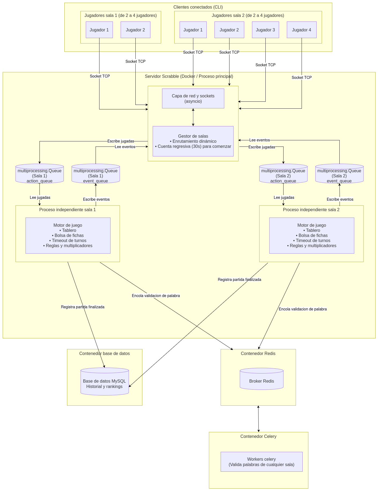

# Scrabble multijugador y multi-sala en red

**Materia:** Computación II — Universidad de Mendoza  
**Alumna:** Camila Portal  
**Proyecto:** Sistema distribuido de Scrabble multijugador y multi-sala en red  

---

## 1. Descripción general del proyecto

Este proyecto consiste en una aplicación cliente-servidor interactiva por terminal para jugar partidas de Scrabble en red con soporte multijugador y multi-sala simultánea.

El sistema permite que múltiples jugadores se conecten desde sus terminales a un servidor central a través de sockets TCP. El servidor agrupa a los participantes en salas de juego dinámicas (de 2 a 4 jugadores), asignando cada partida a un proceso independiente del sistema operativo. La validación de palabras se envía a una cola de tareas distribuidas en segundo plano (Celery + Redis) para una experiencia en tiempo real sin bloqueos, y los resultados, usuarios y estadísticas históricas se almacenan en una base de datos relacional (PostgreSQL / SQLite).

Todo el backend se encuentra contenerizado mediante Docker y Docker Compose.

---

## 2. Arquitectura del sistema y tecnologías

El sistema implementa una arquitectura distribuida por capas:



### Tecnologías aplicadas:
- **Python 3.12:** Lenguaje principal de desarrollo.
- **AsyncIO:** Manejo de sockets TCP concurrentes no bloqueantes y multiplexación de E/S.
- **Multiprocessing e IPC (`multiprocessing.Queue`):** Creación de procesos hijos aislados por sala (`spawn`) comunicados mediante colas.
- **Celery + Redis:** Cola de tareas distribuidas para la validación de palabras contra el diccionario en memoria RAM en segundo plano.
- **PostgreSQL / SQLAlchemy:** Base de datos relacional para persistencia de usuarios, partidas y generación de ranking histórico.
- **Seguridad criptográfica:** Hashing seguro de contraseñas mediante **PBKDF2-HMAC-SHA256** con salt aleatorio individual generado mediante `secrets`.
- **Docker y Docker Compose:** Despliegue en 4 microservicios `server`, `worker`, `redis`, `db`.
- **Rich:** Interfaz de usuario interactiva y estilizada en consola con renderizado del tablero de 15x15, paneles informativos y atril de fichas.

---

## 3. Inicio rápido

### Requisitos previos:
- Sistema operativo Linux.
- Docker y Docker Compose instalados.
- Python 3.10 o superior (para ejecutar los clientes en el host).

### A. Levantar el backend en contenedores:
Desde la raíz del proyecto, ejecutar:
```bash
docker compose up -d --build
```
Verificar que los 4 servicios estén corriendo:
```bash
docker compose ps
```

### B. Conectar jugadores:
Como Scrabble requiere al menos 2 jugadores por sala, abrir dos o más terminales en el host y ejecutar en cada una:
```bash
python3 -m client.client --port 5000
```

---

## 4. Flujo de juego y comandos

1. **Acceso:** Al conectarse, el jugador puede:
   - `[1]` Iniciar sesión (login con usuario registrado).
   - `[2]` Registrarse (crear nueva cuenta con contraseña protegida).
   - `[3]` Ver ranking histórico de jugadores.
   - `[4]` Jugar como invitado (alias temporal).
2. **Lobby dinámico:**
   - Cada sala admite entre 2 y 4 jugadores.
   - Al entrar el segundo jugador, se activa una cuenta regresiva de 30 segundos. Al completarse los 4 jugadores (o vencer el tiempo), la partida arranca automáticamente.
3. **Turno de juego:**
   A quien le toque el turno, dispondrá de 60 segundos para seleccionar una acción:
   - `[1] Colocar palabra:` Solicita palabra, fila (0-14), columna (0-14) y orientación (`H` para horizontal, `V` para vertical). *Nota: La primera jugada debe pasar por el centro (7, 7).*
   - `[2] Cambiar fichas:` Devuelve fichas a la bolsa a cambio de nuevas y pasa el turno.
   - `[3] Convertir comodín:` Si se posee una ficha `*`, se le asigna la letra deseada.
   - `[4] Pasar turno:` Cede el turno al siguiente participante.
   - `[5] Rendirse / Salir:` Abandona la partida.

---

## 5. Estructura del repositorio

```text
Final-Compu2-Scrabble/
├── app/
│   ├── client/          # Cliente de terminal (protocolo de red, UI con Rich)
│   ├── database/        # Modelos ORM, repositorio y conexión SQLAlchemy
│   ├── game/            # Motor de Scrabble (tablero, celdas, fichas, reglas)
│   ├── server/          # Servidor TCP asyncio, lobby y procesos de sala (IPC)
│   └── tasks/           # Configuración de Celery y tareas de diccionario
├── doc/                 # Documentación técnica y diagramas
│   ├── Arquitectura.png
│   └── descripcion.md
├── docker-compose.yml   # Orquestador multi-servicio (server, worker, redis, db)
├── Dockerfile           # Imagen de Python para server y worker
├── .dockerignore        # Exclusiones de construcción de imágenes
├── requirements.txt     # Dependencias de Python
├── pyproject.toml       # Configuración del paquete editable de Scrabble
├── INSTALL.md           # Guía de instalación y despliegue
├── INFO.md              # Justificación técnica
├── TODO.md              # Mejoras futuras
└── README.md            # Este documento
```
